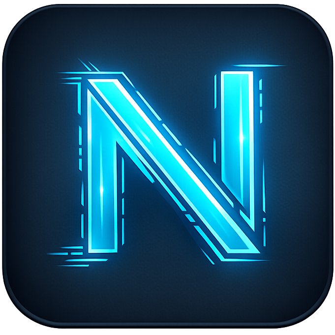

<p align="center">
  
</p>

<h1 align="center">Noctalum</h1>

<p align="center"><em>The free and portable contest logger</em></p>

---

Noctalum is a modern, self-hosted contest logger for amateur radio. A single
Go binary serves the database, a real-time multi-operator backend, and a dark,
Material-style web UI. Multiple operators sign in with their own callsigns
and log into one shared contest log under a club or station call — all
synchronized live across every connected client.

It is designed for the realities of field operating: small clubs, portable
DXpeditions, multi-op weekend contests, and laptops sitting next to a radio
in a tent. One file to run, SQLite on disk, and a small companion helper
that bridges a local transceiver to the server through Hamlib.

## Table of contents

- [Highlights](#highlights)
- [Screens and tabs](#screens-and-tabs)
- [Architecture](#architecture)
- [Components](#components)
- [Quick start](#quick-start)
- [Building from source](#building-from-source)
- [Running in Docker](#running-in-docker)
- [Operator concepts](#operator-concepts)
- [Hamlib and transceiver integration](#hamlib-and-transceiver-integration)
- [WSJT-X integration](#wsjt-x-integration)
- [Exports](#exports)
- [Permissions and access control](#permissions-and-access-control)
- [Authentication](#authentication)
- [Internationalization](#internationalization)
- [DX cluster](#dx-cluster)
- [QRZ.com lookups](#qrzcom-lookups)
- [Layout editor](#layout-editor)
- [Audit log](#audit-log)
- [Configuration reference](#configuration-reference)
- [Data and backups](#data-and-backups)
- [Tech stack](#tech-stack)
- [Project layout](#project-layout)

## Highlights

- **One binary, no dependencies.** The server is a single static Go executable
  with the web UI embedded. SQLite (pure-Go `modernc.org/sqlite`) handles
  persistence — no external database to run.
- **Multi-operator, real-time.** Every QSO entered on any client appears
  instantly on every other client over a WebSocket hub.
- **Shared station callsign.** Each operator logs in with their own call but
  works under one shared contest call (e.g. a club station). Both are recorded
  on every QSO.
- **Multi-contest.** A single server can host many contests in parallel,
  including private contests with explicit authorized user lists.
- **Hamlib integration.** A small cross-platform helper runs alongside
  rigctld and pushes the rig's frequency and mode to the server. Operators
  pick which rig to bind to from a list. A bundled rigctld is shipped with
  the helper so most users don't need to install Hamlib separately.
- **GUI helper for non-technical operators.** A Wails-based desktop app
  auto-detects the serial port, probes for the correct Hamlib model, finds
  the highest working baud rate, and saves named TRX profiles.
- **WSJT-X bridge.** A separate bridge listens for WSJT-X `LOG_QSO` UDP
  messages and posts each QSO to the selected contest.
- **DX cluster.** Telnet DX cluster feed shared across all operators, with
  configurable retention and automatic reconnect.
- **In-app chat** between connected operators, with optional sounds.
- **QRZ.com lookups** for name, locator, and profile picture.
- **Mode-aware validation.** RST tone is collected for CW only; voice modes
  use RS; digital modes accept appropriate numeric reports.
- **Exports.** ADIF, Cabrillo, CSV, EDI.
- **Authentication.** Username/password plus WebAuthn passkeys (biometric or
  PIN). Sessions are cookie-based.
- **Granular permissions.** Built-in roles plus per-user role assignments,
  per-contest authorized-user lists, and a permission catalogue covering
  QSO export, settings, audit log, user management, rig simulation, etc.
- **Audit log** with configurable display timezone.
- **Localized UI.** English and German, with a per-user language preference.
- **Customizable layout.** A drag-and-drop layout editor lets operators
  rearrange the logging screen; long-press on a tile opens a context menu.

## Screens and tabs

The main screen is organized into a top-level set of tabs (**Logging**,
**Statistics**, **Settings**, **Export**) and an operations panel with
**Status**, **Cluster**, **Chat**, and **Objective** sub-tabs.

The logging tab contains the QSO entry form, the live QSO history, the list
of connected operators, and the current shared station callsign and rig
status. Administrators additionally see **Contests** and **Users**
management screens.

## Architecture

```
+------------------+        WebSocket / HTTPS         +-------------------+
|  Web browser     | <------------------------------> |                   |
|  (web UI)        |                                  |                   |
+------------------+                                  |                   |
                                                      |   Noctalum server |
+------------------+   WebSocket (helper token)       |   (Go binary)     |
|  noctalum-helper | <------------------------------> |                   |
|  + local rigctld |                                  |   embedded UI     |
+------------------+                                  |   SQLite store    |
        ^                                             |                   |
        | local TCP (Hamlib)                          |                   |
        v                                             |                   |
   +---------+                                        +-------------------+
   |  Radio  |                                                ^
   +---------+                                                |
                                                              | HTTPS
+--------------------+                                        |
| noctalum-wsjtx     | ---------------------------------------+
| (WSJT-X bridge)    |
+--------------------+
        ^
        | UDP LOG_QSO
        v
   +--------+
   | WSJT-X |
   +--------+
```

The server is the single source of truth. Browsers connect over WebSocket
for live updates. Helpers authenticate with a per-server token (visible to
admins in **Settings**) and publish rig telemetry. Operators bind their
session to a named rig to receive frequency and mode updates.

## Components

| Binary                 | Purpose                                                                 |
|------------------------|-------------------------------------------------------------------------|
| `noctalum`             | The server. Serves the web UI, API, and WebSocket hub.                  |
| `noctalum-helper`      | CLI bridge from local rigctld to the server. Embeds rigctld binaries.   |
| `noctalum-helper-gui`  | Desktop GUI version of the helper (Wails). Auto-detects port and model. |
| `noctalum-wsjtx`       | Bridges WSJT-X `LOG_QSO` UDP messages into a Noctalum contest.          |

Pre-built artifacts for Linux (amd64, arm64), macOS (amd64, arm64), and
Windows (amd64) are produced under `dist/` by `build.sh`.

## Quick start

### 1. Run the server

```
./noctalum -addr :8080 -db ./noctalum.db
```

Flags:

- `-addr` — HTTP listen address (default `:8080`).
- `-db` — path to the SQLite database file (default `noctalum.db`).
- `-downloads-dir` — optional directory whose files are served under
  `/downloads/`. Used to host the helper binaries for operators to download
  directly from the server.

### 2. First-run setup

Open `http://<host>:8080` in a browser. On the first visit the server shows
a **setup** screen that creates the initial administrator account with a
username, password, and operator callsign. After that, additional users can
be created from the **Users** screen.

### 3. Create or join a contest

From the contest picker screen, either create a new contest (public or
private, with a station callsign) or join an existing one. Private contests
require the admin to add operators to the authorized-user list.

### 4. Optional — connect a radio

Download the helper for your operating system from the server's **Downloads**
page (or copy it from `dist/`). Run it once without arguments to launch the
interactive setup, or use the GUI helper for auto-detection. Enter the
server URL and the helper token shown in **Settings**. Once connected, the
rig appears in the rig list; bind your session to it from the operations
panel.

## Building from source

`build.sh` cross-compiles every binary inside a Go Docker (or Podman)
container, so no local Go toolchain is required.

```
./build.sh                          # build everything (server, helper, wsjtx, GUI)
./build.sh --server-only            # only the noctalum server
./build.sh --helper-only            # only the noctalum-helper
./build.sh --wsjtx-only             # only the noctalum-wsjtx bridge
./build.sh --gui-only               # only the noctalum-helper-gui (linux, windows)
./build.sh --no-gui                 # skip the GUI helper
./build.sh --target linux/amd64     # restrict to one OS/arch
./build.sh --image golang:1.23      # use a different builder image
./build.sh --native                 # use the local Go toolchain instead of Docker
```

Output ends up in `dist/`. The GUI helper requires CGO and a platform-specific
WebKit/WebView2 toolchain; Linux and Windows GUI builds are containerized,
while macOS GUI builds require Xcode and must be done natively with
`wails build` from `cmd/helper-gui/`.

Direct Go invocations also work if you have a local toolchain:

```
go build -o noctalum .
go build -o noctalum-helper ./cmd/helper
go build -o noctalum-wsjtx  ./cmd/wsjtx
```

## Running in Docker

A minimal `docker-compose.yml` is included:

```yaml
services:
  noctalum:
    image: debian:bookworm-slim
    command: /app/noctalum-server -addr :8675 -db /data/noctalum.db -downloads-dir /downloads
    volumes:
      - ./app/noctalum-server:/app/noctalum-server:ro
      - ./app/downloads:/downloads:ro
      - ./data:/data
      - /etc/ssl/certs:/etc/ssl/certs:ro
    ports:
      - "127.0.0.1:8675:8675"
    restart: unless-stopped
```

`deploy.sh` is a reference deployment script that builds all binaries,
copies them to a remote host over SSH, and restarts the Compose stack.
Adapt the `SSH_HOST`, `SSH_KEY`, and remote paths at the top of the script
to your environment.

## Operator concepts

**Operator callsign vs station callsign.** Each user logs in with their
personal call (e.g. `DL1ABC`). Every contest has a single shared station
callsign (e.g. `DK0XYZ`) under which all operators work. Both are stored
on every QSO so the logbook always shows who worked the contact and on
behalf of which station.

**Contests.** The server holds many contests at once. Each contest has a
status (active, finished, etc.) and an optional authorized-user list for
private contests. Operators pick a contest after logging in.

**Rigs.** A "rig" is a logical channel published by a helper. Multiple
helpers can publish multiple rigs to the same server. An operator binds
their session to one rig at a time; the rig's current frequency and mode
populate the QSO entry form. Administrators with the `rig.simulate`
permission can also create dummy rigs for testing.

**Real-time sync.** QSOs, operator presence, rig telemetry, chat, and
cluster spots all flow through the WebSocket hub. There is no need to
refresh the page.

## Hamlib and transceiver integration

Browsers cannot talk to USB transceivers directly. Noctalum solves this
with a small helper that runs next to the rig and bridges Hamlib's
`rigctld` to the server.

Two variants are provided:

- **`noctalum-helper`** — terminal/CLI. Run it without arguments for an
  interactive TUI that asks for server URL, helper token, rig model, serial
  device, baud rate, and polling interval. Or pass everything as flags for
  unattended startup. A bundled `rigctld` is embedded for Linux, macOS, and
  Windows so most users don't need a separate Hamlib install.
- **`noctalum-helper-gui`** — desktop GUI (Wails). Auto-detects the serial
  port, probes a curated list of transceivers to find the right Hamlib
  model, searches for the highest working baud rate, and lets operators
  save and switch between named TRX profiles.

The UI shows the current rig connection status (connected, disconnected,
error) and lets operators rebind to a different rig at any time. Helper
tokens can be regenerated by admins from the **Settings** screen.

## WSJT-X integration

`noctalum-wsjtx` listens on UDP for WSJT-X `LOG_QSO` messages and posts
each QSO to the selected Noctalum contest. The bridge logs in with a
username and password, lets the operator pick a contest at startup, and
then runs in the background. This is the recommended path for FT8 / FT4
operating during a contest.

## Exports

Logs can be exported from the **Export** tab (requires the `qso.export`
permission):

- **ADIF** — general-purpose log interchange format.
- **Cabrillo** — contest submission format.
- **CSV** — flat-file export for analysis and backup.
- **EDI** — VHF/UHF/microwave contest format.

## Permissions and access control

Noctalum uses a role-based permission model. Built-in roles ship with
sensible defaults, and admins can create custom roles from the **Users**
screen. Permissions include (non-exhaustive):

- `users.manage` — create users, assign roles, manage roles
- `contests.manage` — create and edit contests
- `qso.export` — download ADIF / Cabrillo / CSV / EDI
- `settings.write` — change server-wide settings
- `audit.log` — view the audit log
- `rig.simulate` — create dummy rigs

Private contests additionally maintain an explicit authorized-user list,
independent of roles, so a club can run an internal contest without
exposing it to other server users.

## Authentication

- **Password.** Standard username + password. Passwords are hashed with
  bcrypt (via `golang.org/x/crypto`).
- **Passkeys (WebAuthn).** Users can register one or more passkeys from
  the **Settings** screen and sign in with biometrics or a PIN. Passkeys
  require a secure context (HTTPS or `localhost`).
- **Sessions.** Server-side sessions stored in SQLite, with cookie auth
  and CSRF protection on state-changing endpoints.
- **Helper tokens.** Helpers authenticate with a single per-server token
  visible to admins in **Settings**. Regenerating the token immediately
  invalidates all previously connected helpers.

## Internationalization

The web UI ships with English and German translations. Each user can pick
their preferred language from the language switcher; the choice is stored
on the user record so it follows the user across devices.

## DX cluster

A single shared Telnet DX cluster connection is maintained by the server
and streamed to every operator. Admins configure the cluster server,
cluster callsign, and spot retention (in days) from **Settings**. The
connection automatically reconnects on failure.

## QRZ.com lookups

When configured with a QRZ.com XML data subscription, callsign lookups
fetch the operator's name, Maidenhead locator, and profile picture from
QRZ.com and display them inline during QSO entry.

## Layout editor

The logging screen layout is customizable per user. Drag-and-drop tiles
to rearrange the workspace; long-press left-click (or right-click) on a
tile opens a context menu with sizing and removal options. The layout is
persisted on the server.

## Audit log

Administrative actions are recorded in an audit log viewable from the
**Audit** screen (requires the `audit.log` permission). The display
timezone is configurable so logs can be read in local time regardless of
where the server runs.

## Configuration reference

Server flags:

| Flag             | Default        | Description                                                |
|------------------|----------------|------------------------------------------------------------|
| `-addr`          | `:8080`        | HTTP listen address.                                       |
| `-db`            | `noctalum.db`  | Path to the SQLite database file.                          |
| `-downloads-dir` | (unset)        | Directory served under `/downloads/`. Used for helper DLs. |

Per-server settings (managed in the web UI **Settings** screen):

- Helper token (regenerable)
- DX cluster host/port, callsign, and retention
- QRZ.com username and password
- Chat sound configuration
- Audit log display timezone
- Default per-user language

Per-user settings:

- Operator callsign
- Language preference
- Passkey credentials
- Layout

Helper flags (`noctalum-helper`):

| Flag           | Description                                                  |
|----------------|--------------------------------------------------------------|
| `-server`      | Noctalum server URL (default `http://localhost:8080`).       |
| `-name`        | Rig display name (e.g. `IC-7300`). Required.                 |
| `-token`       | Helper token from the server's **Settings**. Required.       |
| `-rig-host`    | rigctld host (default `127.0.0.1`).                          |
| `-rig-port`    | rigctld TCP port (default `4532`).                           |
| `-interval`    | Polling interval in milliseconds (default `1000`).           |
| `-rig-model`   | Hamlib rig model number. If set, rigctld is started for you. |
| `-rig-device`  | Serial device (e.g. `/dev/ttyUSB0`, `COM3`).                 |
| `-rig-speed`   | Serial baud rate (0 = rigctld default).                      |
| `-rigctld`     | Path to a rigctld binary (defaults to the embedded one).     |

## Data and backups

All persistent state lives in the SQLite file passed via `-db`. To back
up a running server, copy the database file with a SQLite-aware tool
(e.g. `sqlite3 noctalum.db ".backup backup.db"`) or stop the server
briefly and copy it directly. The `deploy.sh` script's `--transfer-db`
option demonstrates pushing a local DB to a remote host.

A separate `sounds/` directory is created next to the database file for
custom chat sounds.

## Tech stack

- **Language:** Go 1.21+
- **Web UI:** vanilla JavaScript, dark Material-style CSS, Leaflet for maps
- **Storage:** SQLite via `modernc.org/sqlite` (pure Go, no CGO)
- **Realtime:** `gorilla/websocket`
- **Auth:** `go-webauthn/webauthn` + `golang.org/x/crypto/bcrypt`
- **Helper TUI:** `rivo/tview`
- **Helper GUI:** Wails v2 (WebKitGTK on Linux, WebView2 on Windows, WebKit on macOS)
- **Embedded rigctld:** Hamlib `rigctld` binaries bundled per platform

## Project layout

```
.
├── main.go                  # server entry point
├── internal/
│   ├── server/              # HTTP/WebSocket handlers, auth, hub, cluster, exports
│   │   └── web/             # embedded web UI (HTML, CSS, JS, i18n, leaflet)
│   └── store/               # SQLite store (QSOs, users, sessions, contests, audit)
├── cmd/
│   ├── helper/              # CLI rigctld bridge
│   ├── helper-gui/          # Wails GUI rigctld bridge
│   └── wsjtx/               # WSJT-X UDP -> Noctalum bridge
├── build.sh                 # cross-compile all binaries (Docker-based)
├── deploy.sh                # reference SSH/Docker-Compose deploy script
├── docker-compose.yml       # minimal production compose file
├── REQUIREMENTS.md          # original requirements specification
├── noctalum.png             # app logo
└── dist/                    # build output (created by build.sh)
```
